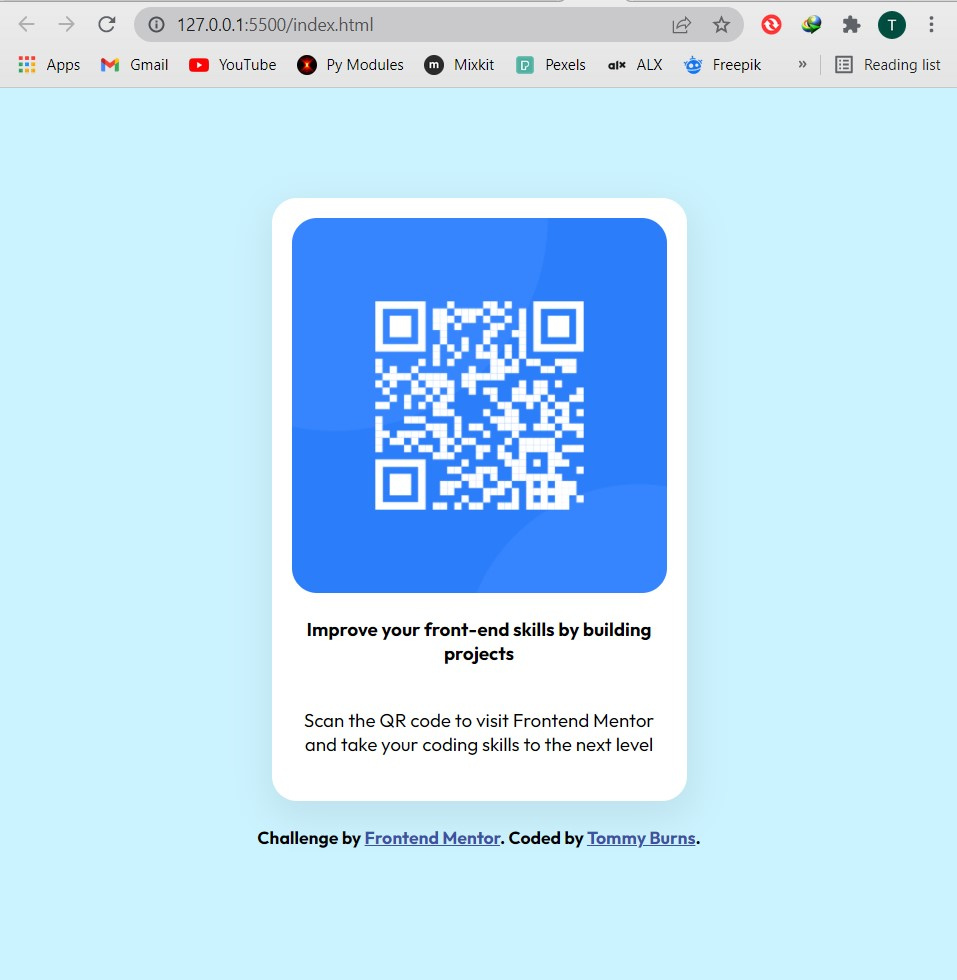

# Frontend Mentor - QR code component solution

This is a solution to the [QR code component challenge on Frontend Mentor](https://www.frontendmentor.io/challenges/qr-code-component-iux_sIO_H). Frontend Mentor challenges help you improve your coding skills by building realistic projects. 

## Table of contents

- [Overview](#overview)
  - [Screenshot](#screenshot)
  - [Links](#links)
- [My process](#my-process)
  - [Built with](#built-with)
  - [What I learned](#what-i-learned)
  - [Continued development](#continued-development)
- [Author](#author)
- [Acknowledgments](#acknowledgments)


## Overview

### Screenshot Of Finished Project




### Links

- Solution URL: [Add solution URL here](https://github.com/Tommy-Burns/qr-code-component)
- Live Site URL: [Add live site URL here](https://tommy-burns.github.io/qr-code-component/#)

## My process

### Built with

- HTML5
- CSS 
- Flexbox

### What I learned

I learned how to use HTML tags to develop various sections of a webpage and how to style them with CSS.


```html
<h1>Web Development is an interesting field!</h1>
```
```css
.qr-code-component {
  color: blue;
}
```


### Continued development

I looked forward to advancing higher in this development carrier and find myself in one of the top Tech Companies.


## Author
- Frontend Mentor - [Tommy Burns](https://www.frontendmentor.io/profile/Tommy-Burns)
- LinkedIn - [Thomas Burns Botchwey](https://www.linkedin.com/in/thomas-burns-botchwey-4a4315201/)


## Acknowledgments

I thank Frontend Mentor for the opportunity given me to polish up my skills.
